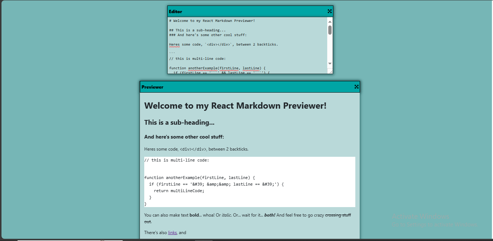

# Markdown preview

## Features

- type any kind of text in textarea, and this will be displayed in div like an html.
- You can use any html tag.
- resize windows(textarea, preview container).

## Technologies used

- React
- Typescript
- marked.js

## installation

- clone the repository
- change directory
- npm install
- npm run dev

### Author

- luka kilasonia
- github: https://github.com/kila21
- linkedin: https://www.linkedin.com/in/luka-kilasonia-937a9a211/
